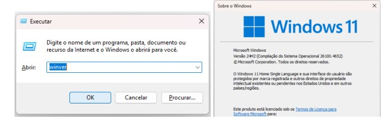
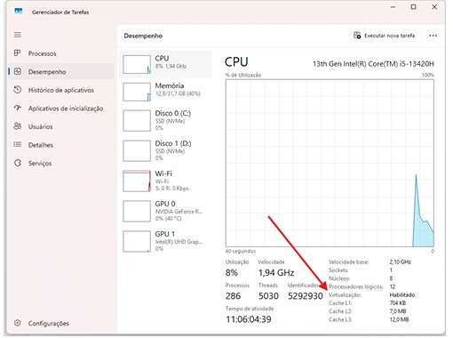
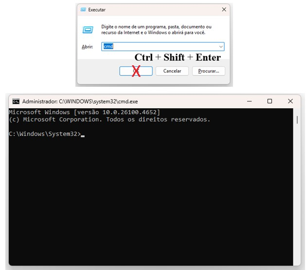
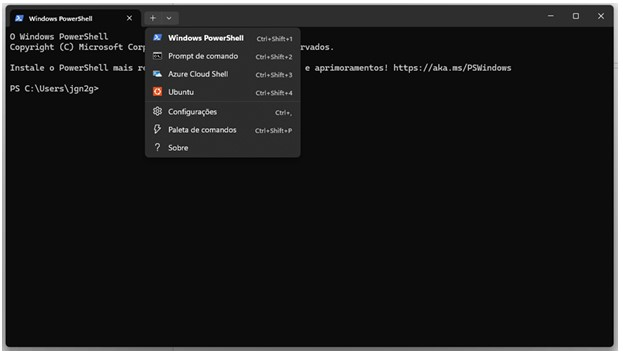
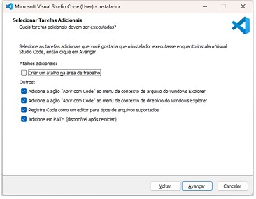
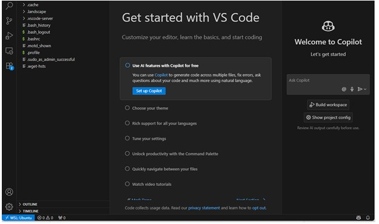
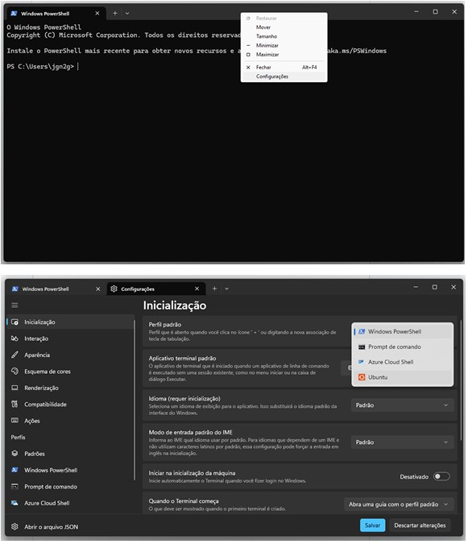
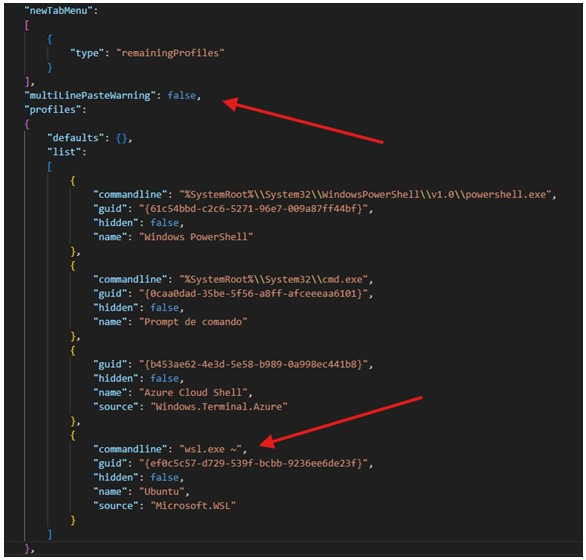
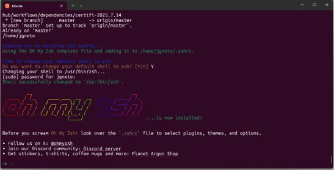
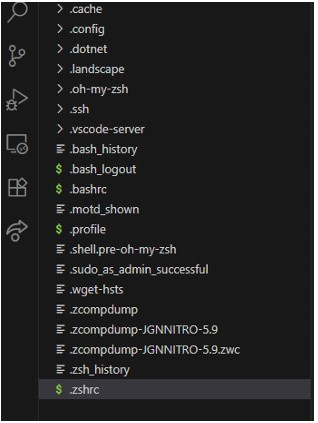

# Step-by-Step Programming Setup

> **A professional programming environment setup guide for Python on Windows with WSL, focusing on Machine Learning and Data Science workflows.**

This is my professional setup for programming in Python, focusing on adding the tools to best support the task I usually do. Since some libraries have continued support for Linux systems (like GPU use for TensorFlow), this focuses on the installation of **Windows Subsystem for Linux**, along with tools to facilitate terminal use (**Oh My Zsh**) and integration to external tools (like **GitHub**).

---

## 📑 Table of Contents

1. [Version Verification](#1-version-verification)
2. [Enable Virtualization](#2-enable-virtualization)
3. [WSL and Ubuntu](#3-wsl-and-ubuntu)
4. [Visual Studio Code](#4-visual-studio-code)
5. [Connecting VSCode to WSL](#5-connecting-vscode-to-wsl)
6. [Configuring the Windows Terminal App](#6-configuring-the-windows-terminal-app)
7. [Improving the VSCode Experience](#7-improving-the-vscode-experience)
8. [Improving the Terminal Experience](#8-improving-the-terminal-experience)
9. [Connecting to GitHub](#9-connecting-to-github)
10. [Adding and Editing Dotfiles](#10-adding-and-editing-dotfiles)
11. [Customizing zsh and git](#11-customizing-zsh-and-git)
12. [Dotfiles Creation](#12-dotfiles-creation)
13. [Installing Oh My Zsh Plugins](#13-installing-oh-my-zsh-plugins)
14. [Customizing VSCode Settings](#14-customizing-vscode-settings)
15. [Customizing Git](#15-customizing-git)
16. [Connecting your Browser to the Terminal](#16-connecting-your-browser-to-the-terminal)
17. [Pyenv Installation](#17-pyenv-installation)
18. [Installing All Purpose Packages](#18-installing-all-purpose-packages)
19. [Customizing Jupyter Notebook](#19-customizing-jupyter-notebook)

---

## 1. Version Verification

Some installation steps differ depending on your Windows version. Although all screenshots in this material show the Windows 11 installation, any differences for Windows 10 installations are mentioned in the text. If nothing is specified, the steps are the same in both versions.

**To verify your Windows version:**

- Use `⊞ Win + R` to open the run dialog box
- Run the `winver` command
- A window will pop up with your Windows version

<p align="center">
  
</p>

- If you have **Windows 11**, all good.
- If you have **Windows 10** showing **2004 or above**, all good.
- If you have **Windows 10 below 2004**, you need to update the system:
  - Use `⊞ Win + R` to open the run dialog box
  - Run the `ms-settings:windowsupdate` command
  - Check and execute updates until you have at least Windows 10 version 2004

---

## 2. Enable Virtualization

We need virtualization activated to enable multiple virtual machines on the computer.

**To check if it's already active:**

- Use `⊞ Win + R` to open the run dialog box
- Run the `taskmgr` command
- Under the **Performance** tab, select the **CPU** option
- Look for **"Virtualization"**

<p align="center">
  
</p>

If it's **"Enabled"**, all good. If it's not listed or if it's **"Disabled"**, follow [this Windows tutorial](https://support.microsoft.com/en-us/windows/enable-virtualization-on-windows-c5578302-6e43-4b4b-a449-8ced115f58e1) to activate it.

---

## 3. WSL and Ubuntu

WSL (Windows Subsystem for Linux) allows us to run a Linux environment within a Windows machine, without needing to set dual-boot. We'll use **Ubuntu** (an open-source Linux-based OS) with **WSL 2** for better performance and compatibility.

### Installing WSL

1. Use `⊞ Win + R` to open the run dialog box
2. Type the `cmd` command, but **don't press "OK"**
3. Press `Ctrl + Shift + Enter` to run as administrator
4. Select the **Yes** option
5. A terminal executing as Windows System will pop up
6. In the terminal, run the command:

```bash
wsl --install
```

7. An Ubuntu installation will begin and **restarting your computer might be required**

<p align="center">
  
</p>

### Checking WSL Version

1. Use `⊞ Win + R` to open the run dialog box
2. Run the `cmd` command (no need to run with Admin Privileges)
3. In the terminal, run:

```bash
wsl -l -v
```

- If it shows **version 2**, all good.
- If it shows **version 1**, run:

```bash
wsl --set-version Ubuntu 2
```

After completion, run `wsl -l -v` once more to make sure all is good.

### First Time Setup

With WSL installed, type **"Terminal"** on your Windows search bar and open the Terminal app. PowerShell is the default terminal, but you can open a new tab with any type of terminal by clicking the arrow pointing down. Select the **Ubuntu** terminal.

> [!NOTE]
> If you're using **Windows 10**, you can install the Terminal app through the **Microsoft Store**.

<p align="center">
  
</p>

On the first time opening the Ubuntu terminal, it will prompt you to create a user account:

- Type a **username** only with lowercase, one word, and no special characters nor space
- Type a **password** you won't forget (characters are invisible and the pointer won't move)
- **Confirm** the password

🎉 Congratulations, you have access to Linux on your Windows machine.

### Verify Default Locale

- In the Ubuntu terminal, run `locale`
- If the list doesn't include `LANG=en_US.UTF-8`, run:

```bash
sudo locale-gen en_US.UTF-8
```

- Input your password for authorizing it
- Close the terminal and open a new one
- Rerun `locale` to verify

If `LANG=en_US.UTF-8` is still missing, run:

```bash
sudo update-locale LANG=en_US.UTF8
sudo apt-get update
sudo apt-get install language-pack-en language-pack-en-base manpages
```

Then:

- Run `sudo locale-gen en_US.UTF-8`
- Input your password
- Close the terminal and open a new one
- Rerun `locale` — `LANG=en_US.UTF8` should be listed

> [!TIP]
> Before continuing, make sure to **pin the Terminal app** to your Windows bar.

---

## 4. Visual Studio Code

Some configurations require directly editing specific lines in text files. We'll install **Visual Studio Code (VSCode)** to make this easier. Additionally, VSCode is a great coding tool for future uses.

1. Go to the [VSCode website](https://code.visualstudio.com/) and download the Windows installer
2. When installing, make sure to **select all options tagged as "Other"** on the setup step:

<p align="center">
  
</p>

- ✅ Add "Open with Code" action to Windows Explorer file context menu
- ✅ Add "Open with Code" action to Windows Explorer directory context menu
- ✅ Register Code as an editor for supported file types
- ✅ Add to PATH (available after restart)

---

## 5. Connecting VSCode to WSL

Once the installation is done, let's connect VSCode to WSL:

1. Run the following command on your Ubuntu terminal:

```bash
code --install-extension ms-vscode-remote.remote-wsl
```

2. Test if it works by typing `code .` on the terminal (the dot indicates you want to execute the command on the current folder)
3. This should open VSCode in your Ubuntu profile

> [!NOTE]
> Note the **WSL: Ubuntu** blue rectangle on the lower left corner of the app.

<p align="center">
  
</p>

---

## 6. Configuring the Windows Terminal App

### Set Ubuntu as Default Terminal

- Right-click the top of the terminal window and select **Settings**
- Select **Ubuntu** as the default profile and choose a color theme (**Save** before continuing)
- On the bottom left corner, click on **Open JSON file**
- The code for the terminal settings will open on VSCode

<p align="center">
  
</p>

### Edit Terminal JSON

Above `"profiles"` add a new line:

```json
"multiLinePasteWarning": false,
```

In `"profiles"` → `"list"`, look for the block with `"name": "Ubuntu"` and add:

```json
"commandline": "wsl.exe ~",
```

<p align="center">
  
</p>

> [!NOTE]
> - The `"commandline": "wsl.exe ~"` line makes sure Ubuntu always starts at the home directory.
> - The `"multiLinePasteWarning": false` line suppresses warnings when pasting multiple lines of code.

**Save the JSON file before closing the VSCode window.**

> [!IMPORTANT]
> From now on, every time this tutorial refers to **"terminal"** it will be the **Ubuntu terminal**, unless specified otherwise.

---

## 7. Improving the VSCode Experience

There are a series of extensions on VSCode that improve coding and collaboration:

| Extension | Description |
|-----------|-------------|
| **Python** | Adds support to Python language |
| **Python Indent** | Adjusts Python indentation |
| **Pylance** | Adds coding features like semantic colorization |
| **Jupyter** | Allows coding with kernels like in Jupyter Notebooks |
| **Sublime Text Keymap** | Adds features from Sublime Text |
| **VSCode Great Icons** | Adds Emojis to VSCode |
| **Live Share** | Allows real-time sharing and editing of code |
| **SQLite** | Allows to explore and query SQLite databases |

To install all extensions, run the following in your terminal (copy and paste all at once):

```bash
code --install-extension ms-python.python
code --install-extension KevinRose.vsc-python-indent
code --install-extension ms-python.vscode-pylance
code --install-extension ms-toolsai.jupyter
code --install-extension ms-vscode.sublime-keybindings
code --install-extension emmanuelbeziat.vscode-great-icons
code --install-extension MS-vsliveshare.vsliveshare
code --install-extension alexcvzz.vscode-sqlite
```

---

## 8. Improving the Terminal Experience

Now we'll customize the terminal using **zsh** and **Oh My Zsh**. Run the following:

```bash
sudo apt update
sudo apt install -y curl git imagemagick jq unzip vim zsh tree
sh -c "$(curl -fsSL https://raw.github.com/ohmyzsh/ohmyzsh/master/tools/install.sh)"
```

Your password will be asked. Press **"Y"** when it asks if you want to change the default shell to zsh.

<p align="center">
  
</p>

> [!NOTE]
> Notice that you already have `→ ~` where you input command lines, indicating you are already using zsh. From now on, use `exec zsh` to reset your terminal without needing to close and open a new window.

### Install direnv

**direnv** allows you to set `.envrc` and `.env` files with environmental variables restricted to specific directories ([more info](https://direnv.net/)).

```bash
sudo apt-get update; sudo apt-get install direnv
```

---

## 9. Connecting to GitHub

GitHub is essential for version control and collaborative projects. Go to [GitHub's main page](https://github.com), create an account, and **enable Two-Factor Authentication**.

### Install GitHub CLI

```bash
sudo apt remove -y gitsome
curl -fsSL https://cli.github.com/packages/githubcli-archive-keyring.gpg | sudo dd of=/usr/share/keyrings/githubcli-archive-keyring.gpg
```

Run the following as **a single line** (PDFs may add line breaks):

```bash
echo "deb [arch=$(dpkg --print-architecture) signed-by=/usr/share/keyrings/githubcli-archive-keyring.gpg] https://cli.github.com/packages stable main" | sudo tee /etc/apt/sources.list.d/github-cli.list > /dev/null
```

Then install:

```bash
sudo apt update
sudo apt install -y gh
```

Reset your terminal (`exec zsh`) and check: `gh --version`

### Link GitHub Account via SSH

```bash
gh auth login -s 'user:email' -w --git-protocol ssh
```

Follow these steps:

1. Answer **"Y"** to generate a new SSH key. Choose a password (**different from Ubuntu user password**)
2. Choose a title for the SSH key or leave the default
3. You'll get a **one-time code** and a **link**
4. If the browser doesn't open, copy the link and paste it in your browser
5. Select your GitHub profile and add the code
6. Press enter in the terminal to complete

Verify with:

```bash
gh auth status
```

Your terminal is now linked to GitHub! 🎉

---

## 10. Adding and Editing Dotfiles

In Unix-based systems, configurations are stored in **"hidden" files called dotfiles** (names start with a dot). The `.zshrc` file contains environmental variables, command definitions, and other configurations — zsh runs this file every time a new terminal is opened.

> [!NOTE]
> That's why we reset the terminal (`exec zsh`) every time we change `.zshrc` before changes take effect.

Make sure you're at your home directory:

```bash
cd ~
code .
```

You should see many dot files on the explorer menu on the left.

<p align="center">
  
</p>

---

## 11. Customizing zsh and git

Open the `.zshrc` file on VSCode. **Replace** its content with the following (make sure there are no line breaks after pasting):

<details>
<summary>📄 Click to expand full <code>.zshrc</code> content</summary>

```bash
ZSH=$HOME/.oh-my-zsh

# You can change the theme with another one from https://github.com/robbyrussell/oh-my-zsh/wiki/themes
ZSH_THEME="robbyrussell"

# Useful oh-my-zsh plugins
plugins=(git gitfast last-working-dir common-aliases zsh-autosuggestions zsh-syntax-highlighting history-substring-search direnv)

# (macOS-only) Prevent Homebrew from reporting - https://github.com/Homebrew/brew/blob/master/Analytics.md
export HOMEBREW_NO_ANALYTICS=1

# Disable warning about insecure completion-dependent directories
ZSH_DISABLE_COMPFIX=true

# Actually load Oh-My-Zsh
source "${ZSH}/oh-my-zsh.sh"
unalias rm # No interactive rm by default (brought by plugins/common-aliases)
unalias lt # we need `lt` for https://github.com/localtunnel/localtunnel

# Load rbenv if installed (to manage your Ruby versions)
export PATH="${HOME}/.rbenv/bin:${PATH}" # Needed for Linux/WSL
type -a rbenv > /dev/null && eval "$(rbenv init -)"

# Load pyenv (to manage your Python versions)
export PYENV_VIRTUALENV_DISABLE_PROMPT=1
type -a pyenv > /dev/null && eval "$(pyenv init -)" && eval "$(pyenv virtualenv-init - 2> /dev/null)" && RPROMPT+='[🐍 $(pyenv version-name)]'

# Load nvm (to manage your node versions)
export NVM_DIR="$HOME/.nvm"
[ -s "$NVM_DIR/nvm.sh" ] && \. "$NVM_DIR/nvm.sh" # This loads nvm
[ -s "$NVM_DIR/bash_completion" ] && \. "$NVM_DIR/bash_completion" # This loads nvm bash_completion

# Call `nvm use` automatically in a directory with a `.nvmrc` file
autoload -U add-zsh-hook
load-nvmrc() {
  if nvm -v &> /dev/null; then
    local node_version="$(nvm version)"
    local nvmrc_path="$(nvm_find_nvmrc)"

    if [ -n "$nvmrc_path" ]; then
      local nvmrc_node_version=$(nvm version "$(cat "${nvmrc_path}")")

      if [ "$nvmrc_node_version" = "N/A" ]; then
        nvm install
      elif [ "$nvmrc_node_version" != "$node_version" ]; then
        nvm use --silent
      fi
    elif [ "$node_version" != "$(nvm version default)" ]; then
      nvm use default --silent
    fi
  fi
}
type -a nvm > /dev/null && add-zsh-hook chpwd load-nvmrc
type -a nvm > /dev/null && load-nvmrc

# Rails and Ruby uses the local `bin` folder to store binstubs.
export PATH="./bin:./node_modules/.bin:${PATH}:/usr/local/sbin"

# Store your own aliases in the ~/.aliases file and load them here.
[[ -f "$HOME/.aliases" ]] && source "$HOME/.aliases"

# Encoding stuff for the terminal
export LANG=en_US.UTF-8
export LC_ALL=en_US.UTF-8

export BUNDLER_EDITOR=code
export EDITOR=code

# Set ipdb as the default Python debugger
export PYTHONBREAKPOINT=ipdb.set_trace
```

</details>

---

## 12. Dotfiles Creation

> [!IMPORTANT]
> Remember to make sure you don't have any line breaks after pasting the code.

Create the following dotfiles with their respective content:

<details>
<summary>📄 <code>.zprofile</code></summary>

```bash
# Setup the PATH for pyenv binaries and shims
export PYENV_ROOT="$HOME/.pyenv"
export PATH="$PYENV_ROOT/bin:$PATH"
eval "$(/opt/homebrew/bin/brew shellenv 2> /dev/null)"
type -a pyenv > /dev/null && eval "$(pyenv init --path)"
```

</details>

<details>
<summary>📄 <code>.rspec</code></summary>

```
--color --format documentation
```

</details>

<details>
<summary>📄 <code>.irbrc</code></summary>

```ruby
begin
  require 'rubygems'
  require 'pry'
rescue LoadError
end

if defined?(Pry)
  Pry.start
  exit
end
```

</details>

<details>
<summary>📄 <code>.pryrc</code></summary>

```ruby
# https://github.com/pry/pry/tree/master/lib/pry

if defined?(Rails)
  short_env_name_options = {
    'development' => 'dev',
    'production' => 'prod'
  }
  app_name = Rails.application.class.module_parent_name.underscore.dasherize
  env_name = short_env_name_options.fetch(Rails.env) { Rails.env }
  description = 'Prompt has to match the rails app name'
else
  current_directory = Dir.pwd.split('/').last.to_s
  description = 'Prompt has to match the current directory name'
end

# https://github.com/pry/pry/blob/master/lib/pry/prompt.rb
Pry::Prompt.add(:current_app) do |context, nesting, pry_instance, sep|
  format(
    '[%<in_count>s] %<current_app>s(%<context>s)%<nesting>s%<separator>s ',
    in_count: pry_instance.input_ring.count,
    current_app: app_name || current_directory,
    context: env_name || Pry.view_clip(context),
    nesting: (nesting > 0 ? ":#{nesting}" : ''),
    separator: sep
  )
end

prompt = Pry::Prompt[:current_app]
procs = [
  proc { |*args| prompt.wait_proc.call(*args).to_s },
  proc { |*args| prompt.incomplete_proc.call(*args).to_s }
]

Pry.config.prompt = Pry::Prompt.new(
  'custom_app_prompt', description, procs
)
```

</details>

<details>
<summary>📄 <code>.aliases</code></summary>

```bash
# Get External IP / Internet Speed
alias myip="curl https://ipinfo.io/json" # or /ip for plain-text ip
alias speedtest="curl -s https://raw.githubusercontent.com/sivel/speedtest-cli/master/speedtest.py | python -"

# Quickly serve the current directory as HTTP
alias serve='ruby -run -e httpd . -p 8000' # Or python -m SimpleHTTPServer :)

# NOTE: On Q3 2021, Le Wagon decided to change the Web Dev curriculum default text editor
alias stt="echo 'Launching VS Code instead of Sublime Text... (cf ~/.aliases)' && code ."
```

</details>

<details>
<summary>📄 <code>.gitconfig</code></summary>

```ini
[color]
  branch = auto
  diff = auto
  interactive = auto
  status = auto
  ui = auto

[color "branch"]
  current = green
  remote = yellow

[core]
  pager = less -FRSX
  editor = code --wait

[alias]
  co = checkout
  st = status -sb
  br = branch
  ci = commit
  fo = fetch origin
  d = !git --no-pager diff
  dt = difftool
  stat = !git --no-pager diff --stat

  # Set remotes/origin/HEAD -> defaultBranch
  remoteSetHead = remote set-head origin --auto

  # Get default branch name
  defaultBranch = !git symbolic-ref refs/remotes/origin/HEAD | cut -d'/' -f4

  # Clean merged branches
  sweep = !git branch --merged $(git defaultBranch) | grep -E -v " $(git defaultBranch)$" | xargs -r git branch -d && git remote prune origin

  # Pretty log
  lg = log --graph --all --pretty=format:'%Cred%h%Creset - %s %Cgreen(%cr) %C(bold blue)%an%Creset %C(yellow)%d%Creset'

  # Serve local repo
  serve = !git daemon --reuseaddr --verbose --base-path=. --export-all ./.git

  # Checkout to defaultBranch
  m = !git checkout $(git defaultBranch)

  # Removes a file from the index
  unstage = reset HEAD --

[help]
  autocorrect = 1

[push]
  default = simple

[branch "master"]
  mergeoptions = --no-edit

[pull]
  rebase = false

[init]
  defaultBranch = master
```

</details>

---

## 13. Installing Oh My Zsh Plugins

Don't close your VSCode window. Copy and run the following code **in its entirety** in your terminal:

```bash
CURRENT_DIR=$(pwd)
ZSH_PLUGINS_DIR="$HOME/.oh-my-zsh/custom/plugins"

mkdir -p "$ZSH_PLUGINS_DIR"
cd "$ZSH_PLUGINS_DIR" || exit

# zsh-autosuggestions
if [ ! -d "zsh-autosuggestions" ]; then
  echo "-----> Installing zsh plugin 'zsh-autosuggestions'..."
  git clone https://github.com/zsh-users/zsh-autosuggestions
fi

# zsh-syntax-highlighting
if [ ! -d "zsh-syntax-highlighting" ]; then
  echo "-----> Installing zsh plugin 'zsh-syntax-highlighting'..."
  git clone https://github.com/zsh-users/zsh-syntax-highlighting
fi

cd "$CURRENT_DIR"
```

---

## 14. Customizing VSCode Settings

Back to your VSCode, navigate through the browser (left menu): `.vscode-server` → `data` → `Machine`. Create the following files:

<details>
<summary>📄 <code>settings.json</code></summary>

```json
{
  "[python]": {
    "editor.bracketPairColorization.enabled": false,
    "editor.guides.bracketPairs": false,
    "editor.tabSize": 4
  },
  "editor.bracketPairColorization.enabled": true,
  "editor.detectIndentation": false,
  "editor.fontSize": 14,
  "editor.guides.bracketPairs": true,
  "editor.minimap.enabled": false,
  "editor.multiCursorModifier": "ctrlCmd",
  "editor.renderControlCharacters": true,
  "editor.rulers": [80, 120],
  "editor.showFoldingControls": "always",
  "editor.snippetSuggestions": "top",
  "editor.tabSize": 2,
  "emmet.includeLanguages": {
    "erb": "html"
  },
  "emmet.showSuggestionsAsSnippets": true,
  "emmet.triggerExpansionOnTab": true,
  "explorer.confirmDelete": false,
  "files.exclude": {
    "__pycache__": true,
    "_site": true,
    ".asset-cache": true,
    ".bundle": true,
    ".ipynb_checkpoints": true,
    ".pytest_cache": true,
    ".sass-cache": true,
    ".svn": true,
    "**/.DS_Store": true,
    "**/.egg-info": true,
    "**/.git": true,
    "build": true,
    "coverage": true,
    "dist": true,
    "log": true,
    "node_modules": true,
    "public/packs": true,
    "tmp": true
  },
  "files.associations": {
    "*.json": "jsonc"
  },
  "files.hotExit": "off",
  "files.insertFinalNewline": true,
  "files.trimFinalNewlines": true,
  "files.trimTrailingWhitespace": true,
  "files.watcherExclude": {
    "**/audits/**": true,
    "**/coverage/**": true,
    "**/log/**": true,
    "**/node_modules/**": true,
    "**/tmp/**": true,
    "**/vendor/**": true
  },
  "git.enabled": false,
  "notebook.diff.ignoreMetadata": true,
  "notebook.lineNumbers": "on",
  "notebook.markup.fontSize": 13,
  "python.defaultInterpreterPath": "~/.pyenv/shims/python",
  "python.formatting.provider": "yapf",
  "python.languageServer": "Pylance",
  "python.linting.enabled": false,
  "python.linting.flake8Enabled": false,
  "python.linting.pylintEnabled": false,
  "python.terminal.activateEnvironment": false,
  "ruby.lint": {
    "rubocop": true
  },
  "search.exclude": {
    "**/.venv": true
  },
  "telemetry.telemetryLevel": "off",
  "window.restoreWindows": "none",
  "window.newWindowDimensions": "maximized",
  "workbench.editor.enablePreview": true,
  "workbench.iconTheme": "vscode-great-icons",
  "workbench.settings.editor": "json",
  "workbench.settings.openDefaultSettings": true,
  "workbench.settings.useSplitJSON": true,
  "workbench.startupEditor": "newUntitledFile",
  "workbench.panel.defaultLocation": "right"
}
```

</details>

<details>
<summary>📄 <code>keybindings.json</code></summary>

```json
// Place your key bindings in this file to override the defaults
[
  {
    "key": "ctrl+shift+v",
    "command": "pasteAndIndent.action",
    "when": "editorTextFocus && !editorReadonly"
  },
  {
    "key": "cmd+shift+v",
    "command": "pasteAndIndent.action",
    "when": "editorTextFocus && !editorReadonly"
  }
]
```

</details>

Finally, reset the terminal using `exec zsh`.

---

## 15. Customizing Git

Check the emails associated to your GitHub account:

```bash
gh api user/emails | jq -r '.[].email'
```

You will see your registration email and another ending in `noreply.github.com`.

> [!TIP]
> Use the `noreply.github.com` email so your registration email doesn't show when collaborating.

Run the following, replacing `{email}` and `{full_name}`:

```bash
git config --global user.email "{email}"
git config --global user.name "{full_name}"
```

### Add ssh-agent Plugin

```bash
code ~/.zshrc
```

- Find the `plugins=(...)` line
- Add `ssh-agent` after the last plugin (inside the parenthesis)
- Save the file
- Reset the terminal with `exec zsh`
- It should immediately ask for the SSH password

### Verify GitHub Connection

```bash
export GITHUB_USERNAME=`gh api user | jq -r '.login'`
echo $GITHUB_USERNAME
```

> [!IMPORTANT]
> If you close your terminal at any point, this variable will be lost and you'll have to set it again (`exec zsh` won't delete it, because this variable is linked to the terminal session, not to the zsh files).

Test creating a repo:

```bash
cd ~
mkdir -p ~/code/$GITHUB_USERNAME/my_new_repo && cd $_
git init
gh repo create my_new_repo --private --source=. --remote=origin
```

Create a test file and push:

```bash
echo "# My Private Project" > README.md
git add .
git commit -m "Initial commit"
git push -u origin master
```

🎉 Your GitHub connection is ready!

---

## 16. Connecting your Browser to the Terminal

We'll add the `BROWSER` and `GH_BROWSER` variables to `.zshrc`.

### Step 1: Find Your Browser's .exe Path

1. Search for Chrome (or your preferred browser) on Windows search bar
2. Right-click the application → **Open file location**
3. Right-click the shortcut → **Properties**
4. Look for the **"Start in"** information
5. Verify `chrome.exe` is in that folder

### Step 2: Convert the Path

From the Windows path:
- Replace backslashes (`\`) with slashes (`/`)
- Replace `C:` with `/mnt/c`
- Add `/chrome.exe` to the end

Run (replacing `{PATH}` with your result):

```bash
echo "export BROWSER=\"{PATH}\"" >> ~/.zshrc
echo "export GH_BROWSER=\"'{PATH}'\"" >> ~/.zshrc
```

**Example** (Chrome):

```bash
echo "export BROWSER=\"/mnt/c/Program Files/Google/Chrome/Application/chrome.exe\"" >> ~/.zshrc
echo "export GH_BROWSER=\"'/mnt/c/Program Files/Google/Chrome/Application/chrome.exe'\"" >> ~/.zshrc
```

Reset your terminal: `exec zsh`

---

## 17. Pyenv Installation

**Pyenv** allows managing different Python versions, which is very versatile for project development ([more info](https://github.com/pyenv/pyenv)).

### Remove Anaconda (if installed)

Run `conda list`. If you get `zsh: command not found: conda`, skip this section.

If Anaconda is installed:

```bash
conda install anaconda-clean
anaconda-clean --yes
rm -rf ~/anaconda2
rm -rf ~/anaconda3
rm -rf ~/.anaconda_backup
```

- Edit `.bash_profile`: delete the `export PATH="/path/to/anaconda3/bin:$PATH"` line
- Edit `.zshrc`: erase all lines from `>>> conda initialize >>>` to `<<< conda initialize <<<`
- Reset terminal: `exec zsh`

### Install Pyenv

```bash
git clone https://github.com/pyenv/pyenv.git ~/.pyenv
exec zsh
```

Install dependencies:

```bash
sudo apt-get update; sudo apt-get install make build-essential libssl-dev zlib1g-dev \
libbz2-dev libreadline-dev sqlite3 libsqlite3-dev wget curl llvm \
libncursesw5-dev xz-utils tk-dev libxml2-dev libxmlsec1-dev libffi-dev liblzma-dev \
python3-dev
```

> [!WARNING]
> ### ⚠️ Etapa Importante Antes de Instalar o Python
>
> **Se o comando `pyenv` não for reconhecido**, você precisa adicionar o Pyenv ao seu perfil do Zsh. Copie e cole este bloco inteiro no terminal e aperte Enter:
>
> ```bash
> echo 'export PYENV_ROOT="$HOME/.pyenv"' >> ~/.zshrc
> echo '[[ -d $PYENV_ROOT/bin ]] && export PATH="$PYENV_ROOT/bin:$PATH"' >> ~/.zshrc
> echo 'eval "$(pyenv init -)"' >> ~/.zshrc
> ```
>
> Depois, atualize o terminal:
>
> ```bash
> source ~/.zshrc
> ```
>
> **Por que isso pode ser necessário?** O tutorial original manda usar `source ~/.zprofile`, mas no Ubuntu/Debian o Zsh usa mais comumente o arquivo `.zshrc`. O `git clone` coloca o pyenv em `~/.pyenv`, mas essa pasta precisa estar no PATH do sistema.
>
> 💡 **Dica técnica:** Se você trabalha com Machine Learning e Engenharia, o pyenv é ótimo para isolar as dependências dos seus projetos sem quebrar o Python padrão do sistema.

Now install Python:

```bash
pyenv install 3.12.7
```

> [!NOTE]
> If you get `zsh: command not found: pyenv`, run `source ~/.zprofile` first, or follow the warning box above.

Set global version:

```bash
pyenv global 3.12.7
exec zsh
```

Verify with `python --version`. You should also see the Python version on the right side of the terminal.

### Install pyenv-virtualenv

```bash
git clone https://github.com/pyenv/pyenv-virtualenv.git $(pyenv root)/plugins/pyenv-virtualenv
exec zsh
```

Create a global virtual environment:

```bash
pyenv virtualenv 3.12.7 base_venv
pyenv global base_venv
```

---

## 18. Installing All Purpose Packages

Since `base_venv` is the global venv, any packages installed will be contained within it.

1. Upgrade pip: `pip install --upgrade pip`
2. Open VSCode: `code .`
3. Create a file called `requirements.txt`
4. Paste the following packages:

<details>
<summary>📦 Click to expand full <code>requirements.txt</code></summary>

```
absl-py
annotated-types
anyio
argon2-cffi-bindings
argon2-cffi
array-record
arrow
astroid
asttokens
astunparse
async-lru
attrs
babel
beautifulsoup4
black
bleach
certifi
cffi
charset-normalizer
click
comm
contourpy
cycler
cython
dacite
debugpy
decorator
defusedxml
dill
dm-tree
docstring-parser
etils
executing
fastjsonschema
filelock
flatbuffers
fonttools
fqdn
fsspec
gast
gensim
google-pasta
googleapis-common-protos
graphviz
grpcio
h11
h5py
htmlmin
httpcore
httpx
huggingface-hub
idna
imagehash
imageio
imbalanced-learn
imblearn
immutabledict
importlib-resources
iniconfig
ipdb
ipykernel
ipympl
ipython
ipywidgets
isoduration
isort
jedi
jinja2
joblib
json5
jsonpointer
jsonschema-specifications
jsonschema
jupyter-client
jupyter-core
jupyter-events
jupyter-lsp
jupyter-server-terminals
jupyter-server
jupyterlab-code-formatter
jupyterlab-execute-time
jupyterlab-pygments
jupyterlab-server
jupyterlab-widgets
jupyterlab
kagglehub
keras-hub
keras-nlp
keras
kiwisolver
lazy-loader
libclang
lxml
markdown-it-py
markdown
markupsafe
matplotlib-inline
matplotlib
mccabe
mdurl
memoized-property
mistune
ml-dtypes
mpmath
multimethod
mypy-extensions
namex
narwhals
nbclient
nbconvert
nbformat
nbresult
nest-asyncio
networkx
nltk
notebook-shim
notebook
numpy
numba
opt-einsum
optree
overrides
packaging
pandas
pandocfilters
parso
pathspec
patsy
pexpect
phik
pillow
platformdirs
plotly
pluggy
pmdarima
prometheus-client
promise
prompt-toolkit
protobuf
psutil
ptyprocess
pure-eval
pyarrow
pycparser
pydantic-core
pydantic
pygments
pylint
pyparsing
pytesseract
pytest
python-dateutil
python-json-logger
pytz
pywavelets
pyyaml
pyzmq
referencing
regex
requests
rfc3339-validator
rfc3986-validator
rich
rpds-py
sacremoses
safetensors
scikit-image
scikit-learn
scipy
seaborn
send2trash
sentencepiece
setuptools
simple-parsing
six
sklearn-compat
smart-open
sniffio
soupsieve
stack-data
statsmodels
sympy
tabulate
tensorboard-data-server
tensorboard
tensorflow-datasets
tensorflow-metadata
tensorflow
termcolor
terminado
tf-keras
threadpoolctl
tifffile
tinycss2
tokenizers
toml
tomlkit
torch-2.6.0+cpu.cxx11.abi-cp312-cp312-linux_x86_64.whl; platform_machine == "x86_64"
torch-2.6.0+cpu-cp312-cp312-manylinux_2_28_aarch64.whl; platform_machine == "aarch64"
tornado
tqdm
traitlets
transformers
typeguard
types-python-dateutil
typing-extensions
tzdata
unidecode
uri-template
urllib3
visions
wcwidth
webcolors
webencodings
websocket-client
werkzeug
wheel
widgetsnbextension
wordcloud
wrapt
xgboost
ydata-profiling
zipp
```

</details>

Install them:

```bash
pip install -r requirements.txt
```

> [!WARNING]
> This will take a while to finish. Don't do it when you need your computer.

After completion, you can delete the `requirements.txt`. See installed packages with `pip list`.

---

## 19. Customizing Jupyter Notebook

Create a folder for Jupyter's custom configurations:

```bash
LOCATION=$(jupyter --config-dir)/custom
mkdir -p $LOCATION
code .
```

Inside the `custom` folder, create a file called `custom.css`:

<details>
<summary>📄 <code>custom.css</code></summary>

```css
/* Custom CSS for Jupyter Notebook
   Should go into ~/.jupyter/custom/custom.css
   Only impacts the Jupyter Notebook interface, not VS Code for example
*/

/* Prettify disclosure elements used for hints and solutions */
details {
  padding: 5px 10px 5px;
  margin-bottom: 1em;
}

details[open] {
}

body[data-jp-theme-light=true] details {
  background-color: var(--jp-cell-editor-background);
}
```

</details>

Generate the config file and edit it:

```bash
jupyter notebook --generate-config
sed -i.backup 's/# c.ServerApp.use_redirect_file = True/c.ServerApp.use_redirect_file = False/' ~/.jupyter/jupyter_notebook_config.py
```

### Final Test

Run `jupyter notebook`. Navigate to the `code` folder, create a new notebook, and run:

```python
import sys; sys.version
```

If you get `3.12.7`, you're all set!

---

## 🎉 Congratulations!

**Your programming setup is complete.** You now have a professional development environment with:

- ✅ WSL 2 with Ubuntu
- ✅ Zsh with Oh My Zsh and custom plugins
- ✅ VSCode connected to WSL
- ✅ GitHub CLI with SSH authentication
- ✅ Pyenv for Python version management
- ✅ Virtual environments for project isolation
- ✅ Jupyter Notebook configured and ready
- ✅ A comprehensive set of ML/DS Python packages
